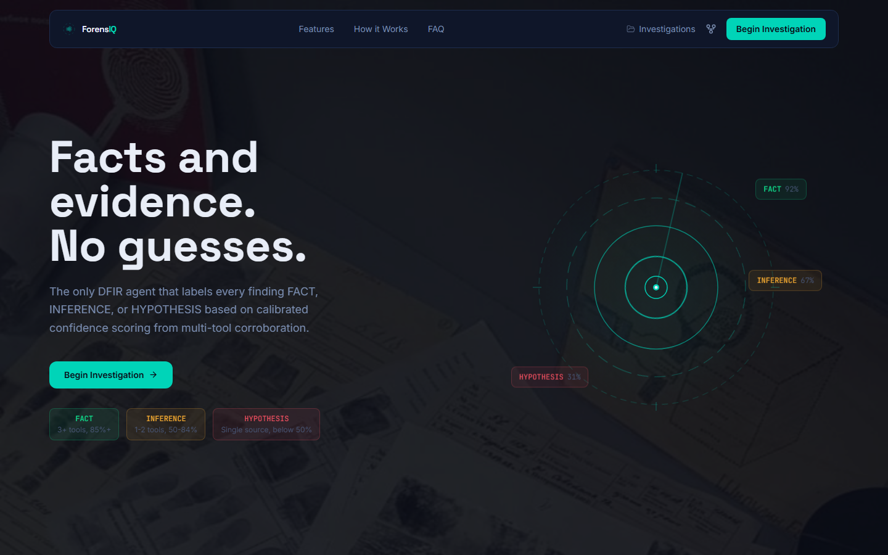
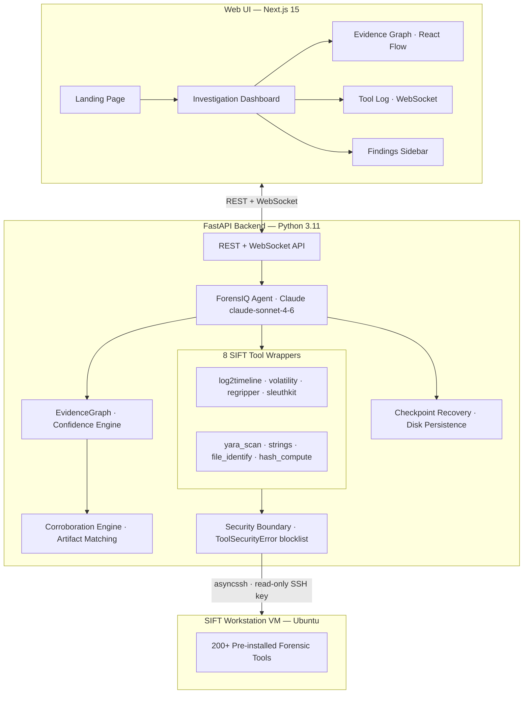

# ForensIQ

**Facts, not guesses. Evidence, not vibes.**

ForensIQ is an autonomous DFIR agent that labels every finding as **FACT**, **INFERENCE**, or **HYPOTHESIS** using deterministic multi-tool confidence scoring, a self-correction loop, and a cryptographic audit trail. Built for enterprise incident response teams who need speed without sacrificing chain of custody.

[](LICENSE)
[](https://github.com/mystiquemide/forensiciq/actions/workflows/ci.yml)
[](https://github.com/mystiquemide/forensiciq/actions/workflows/codeql.yml)
[](https://nextjs.org)
[](https://fastapi.tiangolo.com)
[](https://python.org)
[](https://typescriptlang.org)

Most DFIR tools return a flat list of findings and leave the analyst to guess which ones are solid. ForensIQ makes evidentiary weight explicit. Every finding carries a deterministic confidence tier backed by corroborating tool output, contradictions, and a hashable audit trail that is ready for legal review.

## Product Screens

### Landing page


### Investigation dashboard


## The Problem

Incident responders move fast under pressure. Existing tooling either requires deep manual scripting or produces AI-generated output with no provenance. Neither is acceptable when findings may end up in a court submission or a board-level incident report.

ForensIQ solves this by keeping the analyst in control of confidence, not the LLM. The agent runs the tools, the engine scores the evidence, and the label on every finding reflects what the data actually says.

## Confidence Tiers

| Tier | Threshold | Meaning |
|---|---|---|
| **FACT** | >= 85% confidence, 3+ independent sources | Multiple tools confirmed this. High evidential weight. |
| **INFERENCE** | >= 50% confidence, 1-2 sources | Corroborated but not fully confirmed. Review before acting. |
| **HYPOTHESIS** | < 50% confidence | Single source, low confidence. Do not rely on this finding. |

Scoring is deterministic: base `0.50`, `+0.20` per corroborating tool (capped at `0.95`), `-0.25` per contradiction (floor at `0.10`). No black-box LLM confidence numbers.

## Features

- **Calibrated Confidence Scoring** - Deterministic formula applied to every finding. The agent cannot assign or inflate its own confidence scores.
- **Corroboration Engine** - Artifact matching across tool outputs. When two tools surface the same IP, PID, hash, or path, the finding is automatically corroborated and confidence rises.
- **Live Evidence Graph** - Findings render as nodes in a React Flow graph, colored by confidence tier in real time as the investigation runs.
- **Self-Correction Loop** - After each tool batch, findings below the 70% threshold trigger targeted re-runs. Up to 3 passes per investigation.
- **Checkpoint Recovery** - Investigation state is written to disk after every finding. A backend restart mid-investigation does not lose work.
- **8 SIFT Tool Wrappers** - Volatility, RegRipper, log2timeline, YARA, Sleuth Kit, strings, file identification, and hash computation - all run autonomously over SSH.
- **Cryptographic Audit Trail** - Every tool call records a SHA-256 hash of raw output before the LLM processes it. Chain of custody is verifiable.
- **Structured HTML Report** - One-click export with FACT, INFERENCE, and HYPOTHESIS sections plus the complete audit trail.

## Architecture

ForensIQ is a three-tier system. The web UI connects to a FastAPI backend over REST and WebSocket. The backend runs a Claude agent that calls forensic tools over SSH on a SIFT Workstation VM. Confidence is computed by the EvidenceGraph, never by the LLM.



**Security boundary:** destructive commands (`rm`, `dd`, `shred`, `mkfs`, `chmod`, `chown`) are blocked in `tools/base.py` at the tool layer, not in the agent prompt. The agent cannot bypass this regardless of what the case data contains.

Full detail in [docs/ARCHITECTURE.md](docs/ARCHITECTURE.md).

## Quick Start

### Prerequisites

- Docker 24+ and Docker Compose v2
- SIFT Workstation VM reachable over SSH
- Anthropic API key ([console.anthropic.com](https://console.anthropic.com))

### Docker Compose (recommended)

```bash
git clone https://github.com/mystiquemide/forensiciq.git
cd forensiciq
cp .env.example .env
# Edit .env — set ANTHROPIC_API_KEY, SIFT_HOST, SIFT_USER, SIFT_SSH_KEY_PATH
docker compose up --build
```

- Frontend: `http://localhost:3000`
- Backend API docs: `http://localhost:8000/docs`

### Development mode

```bash
# Backend
cd backend
python -m venv .venv
source .venv/bin/activate   # Windows: .venv\Scripts\activate
pip install -r requirements.txt
cp .env.example .env
uvicorn main:app --reload --port 8000

# Frontend (separate terminal)
cd frontend
npm install
cp .env.local.example .env.local
npm run dev
```

Frontend dev server: `http://localhost:3000`

### Try without a SIFT VM

No VM? No problem. ForensIQ ships a simulation panel you can use to explore the full UI without connecting to real forensic infrastructure.

Open any investigation URL in dev mode:

```
http://localhost:3000/investigation/demo
```

The simulation panel lets you replay a pre-recorded investigation event stream - findings appear, confidence scores climb, self-correction fires, and the evidence graph builds in real time. All UI paths (report export, checkpoint recovery, evidence graph) work exactly as they do in a live run. The only difference is no SSH connection is made to a SIFT VM.

This is the fastest path to verifying the interface before committing to a full SIFT VM setup.

## Environment Variables

| Variable | Required | Description |
|---|---:|---|
| `ANTHROPIC_API_KEY` | Yes | Anthropic API key for the agent runtime |
| `SIFT_HOST` | Yes | IP or hostname of the SIFT Workstation VM |
| `SIFT_PORT` | No | SSH port, default `22` |
| `SIFT_USER` | Yes | SSH username on the SIFT VM |
| `SIFT_SSH_KEY_PATH` | Yes | Path to the SSH private key |
| `FORENSICIQ_HOST` | No | Backend bind host, default `0.0.0.0` |
| `FORENSICIQ_PORT` | No | Backend port, default `8000` |
| `CORS_ORIGINS` | No | Comma-separated allowed frontend origins |
| `CLAUDE_MODEL` | No | Claude model ID, default `claude-sonnet-4-6` |
| `MAX_TOKENS` | No | Max tokens per agent call, default `8192` |
| `MAX_CORRECTION_ITERATIONS` | No | Self-correction passes, default `3` |
| `NEXT_PUBLIC_API_URL` | No | Backend URL for frontend, default `http://localhost:8000` |
| `NEXT_PUBLIC_WS_URL` | No | WebSocket URL for frontend, default `ws://localhost:8000` |

Use `.env.example`, `backend/.env.example`, and `frontend/.env.local.example` as templates. They contain placeholders only - never real credentials.

## API Reference

| Method | Path | Purpose |
|---|---|---|
| `GET` | `/api/health` | Backend health check |
| `POST` | `/api/investigation/start` | Start a new investigation |
| `GET` | `/api/investigation/{id}` | Fetch investigation state and findings |
| `POST` | `/api/investigation/resume/{id}` | Resume an investigation from checkpoint |
| `GET` | `/api/checkpoints` | List all resumable investigations |
| `DELETE` | `/api/checkpoint/{id}` | Delete a saved checkpoint |
| `GET` | `/api/report/{id}` | Export HTML report after investigation completes |
| `WS` | `/api/ws/investigation/{id}` | Stream live investigation events |

Start a new investigation:

```bash
curl -X POST http://localhost:8000/api/investigation/start \
  -H "Content-Type: application/json" \
  -d '{"case_path": "/cases/incident-001"}'
```

Response:

```json
{ "investigation_id": "uuid" }
```

## Scripts

```bash
# Frontend
cd frontend
npm run dev        # development server
npm run build      # production build
npm run lint       # ESLint
npm run typecheck  # tsc --noEmit

# Backend
cd backend
ruff check .                              # lint
pytest tests/ -v                          # run all tests
python -m forensiciq.benchmark --help     # accuracy benchmarking CLI
```

## Repository Layout

```text
forensiciq/
├── backend/
│   ├── main.py
│   ├── requirements.txt
│   ├── Dockerfile
│   └── forensiciq/
│       ├── agent.py             Claude agent + tool_use loop
│       ├── evidence_graph.py    Confidence scoring engine
│       ├── artifacts.py         Artifact extraction + matching
│       ├── benchmark.py         Accuracy benchmarking CLI
│       ├── checkpoint.py        Crash-recovery persistence
│       ├── config.py            Pydantic settings
│       ├── tools/               8 SIFT tool wrappers
│       ├── api/                 REST routes + WebSocket manager
│       └── report/              Jinja2 HTML report generator
├── frontend/
│   ├── Dockerfile
│   └── src/
│       ├── app/                 Next.js App Router pages
│       ├── components/          UI components
│       ├── hooks/               useWebSocket, useInvestigation
│       └── types/               Shared TypeScript types
├── docs/
│   ├── assets/product-screens/
│   ├── ARCHITECTURE.md
│   └── DEPLOYMENT.md
├── evidence/                    Benchmark results and accuracy report
├── docker-compose.yml
└── .env.example
```

## Verification

```bash
cd frontend && npm run lint && npm run typecheck && npm run build
cd ../backend && ruff check . && pytest tests/ -v
```

- Frontend lint: passing
- Frontend type-check: passing
- Frontend build: passing
- Backend lint: passing
- Backend tests: 25 passing

## Deployment

See [docs/DEPLOYMENT.md](docs/DEPLOYMENT.md) for Docker Compose, Railway, and production configuration.

## Contributing

See [CONTRIBUTING.md](CONTRIBUTING.md). Architecture conventions and tool-layer rules are in [AGENTS.md](AGENTS.md).

## Security

Three security properties are enforced at the code level, not at the prompt level. See [SECURITY.md](SECURITY.md) for the full policy and vulnerability reporting process.

## License

MIT. See [LICENSE](LICENSE).
