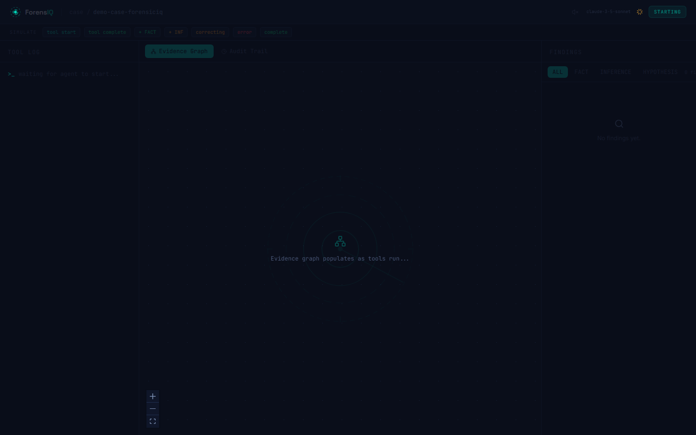

# ForensIQ

**Facts, not guesses. Evidence, not vibes.**

The only DFIR agent that labels every finding FACT, INFERENCE, or HYPOTHESIS using deterministic multi-tool confidence scoring, a cryptographic audit trail, and a self-correction loop. Built for the [SANS Find Evil! Hackathon](https://findevil.devpost.com), June 2026.

[](LICENSE)
[](https://github.com/mystiquemide/forensiciq/actions/workflows/ci.yml)
[](https://nextjs.org)
[](https://fastapi.tiangolo.com)
[](https://python.org)
[](https://typescriptlang.org)

---

Every other DFIR tool gives you a flat list of findings. ForensIQ gives you FACT, INFERENCE, or HYPOTHESIS on every finding, derived from deterministic multi-tool corroboration scoring, not LLM confidence. An analyst reviewing the report knows the exact evidentiary weight behind each finding before acting.

---

## Confidence Tiers

| Tier | Threshold | Meaning |
|---|---|---|
| **FACT** | >= 85% confidence, 3+ independent sources | Multiple tools confirmed this. High evidential weight. |
| **INFERENCE** | >= 50% confidence, 1-2 sources | Corroborated but not fully confirmed. Review before acting. |
| **HYPOTHESIS** | < 50% confidence | Single source, low confidence. Do not rely on this finding. |

The math is deterministic: base 0.50, +0.20 per corroborating tool (capped at 0.95), -0.25 per contradiction (floored at 0.10). No black-box LLM confidence numbers.

---

## Product Screens

### Landing page


### Investigation dashboard


---

## Features

- **Calibrated Confidence Scoring** - Every finding starts at 50% and adjusts deterministically. Each corroborating tool adds 20%, each contradiction removes 25%. No hallucinated confidence scores.
- **Live Evidence Graph** - Findings render as nodes in a React Flow graph, colored by confidence tier in real time. Edges connect findings that share corroborating sources.
- **8 SIFT Tool Wrappers** - Volatility, RegRipper, log2timeline, YARA, Sleuth Kit, strings, file identification, and hash computation all run autonomously over SSH.
- **Self-Correction Loop** - After each tool run, the agent reviews findings below 70% confidence and selects the best corroborating tool to re-run. Up to 3 correction passes per investigation.
- **Cryptographic Audit Trail** - Every tool call produces a SHA-256 hash of its raw output. Every finding links back to the exact tool output that created it. Fully verifiable chain of custody.
- **Structured HTML Report** - One click exports a complete report with FACT, INFERENCE, and HYPOTHESIS sections plus the full audit trail. Ready for incident review or court submission.

---

## Architecture

```
Web UI (Next.js 14 + React Flow + WebSocket)
           REST + WebSocket
FastAPI backend + Claude agent (tool_use loop)
           asyncssh (read-only credentials)
SIFT Workstation VM (Ubuntu)
```

- **Agent layer** (`backend/forensiciq/agent.py`): drives the Claude tool_use loop and manages self-correction iterations
- **Confidence engine** (`backend/forensiciq/evidence_graph.py`): deterministic math, not LLM-generated scores
- **Tool layer** (`backend/forensiciq/tools/`): 8 asyncssh wrappers, each with a security blocklist enforced before SSH connects
- **Frontend** (`frontend/`): Next.js 14, WebSocket hook with auto-reconnect, React Flow evidence graph

Full detail in [docs/ARCHITECTURE.md](docs/ARCHITECTURE.md).

---

## Quick Start

### Prerequisites

- Docker 24+ and Docker Compose v2
- SIFT Workstation VM reachable over SSH
- Anthropic API key

### Docker Compose (recommended)

```bash
git clone https://github.com/mystiquemide/forensiciq.git
cd forensiciq
cp .env.example .env
# Edit .env: set ANTHROPIC_API_KEY, SIFT_HOST, SIFT_USER, SIFT_SSH_KEY_PATH
docker compose up --build
```

Frontend: `http://localhost:3000`
Backend API docs: `http://localhost:8000/docs`

### Development mode

```bash
# Backend
cd backend
pip install -e ".[dev]"
cp .env.example .env
uvicorn main:app --reload --port 8000

# Frontend (separate terminal)
cd frontend
npm install
cp .env.local.example .env.local
npm run dev
```

Frontend dev server: `http://localhost:3001`

---

## Environment Variables

| Variable | Required | Description |
|---|---|---|
| `ANTHROPIC_API_KEY` | Yes | Anthropic API key for Claude |
| `SIFT_HOST` | Yes | IP or hostname of the SIFT VM |
| `SIFT_PORT` | No | SSH port (default: 22) |
| `SIFT_USER` | Yes | SSH username on the SIFT VM |
| `SIFT_SSH_KEY_PATH` | Yes | Path to the SSH private key |
| `FORENSICIQ_HOST` | No | Backend bind host (default: 0.0.0.0) |
| `FORENSICIQ_PORT` | No | Backend port (default: 8000) |
| `CORS_ORIGINS` | No | Allowed CORS origins |
| `CLAUDE_MODEL` | No | Claude model ID (default: claude-sonnet-4-6) |
| `MAX_TOKENS` | No | Max tokens per agent call |
| `MAX_CORRECTION_ITERATIONS` | No | Self-correction passes (default: 3) |
| `NEXT_PUBLIC_API_URL` | No | Backend URL for frontend (default: http://localhost:8000) |
| `NEXT_PUBLIC_WS_URL` | No | WebSocket URL for frontend (default: ws://localhost:8000) |

See `.env.example` for a full template.

---

## Scripts

```bash
# Frontend
cd frontend
npm run dev        # development server
npm run build      # production build
npm run lint       # ESLint
npm run typecheck  # tsc --noEmit

# Backend
cd backend
ruff check .       # linting
mypy forensiciq/   # type checking
pytest tests/ -v   # tests
```

---

## Repository Layout

```
forensiciq/
├── backend/
│   ├── main.py                  FastAPI entry point
│   └── forensiciq/
│       ├── agent.py             Claude tool_use loop + self-correction
│       ├── evidence_graph.py    Confidence scoring engine
│       ├── tools/               8 SIFT tool wrappers (asyncssh)
│       ├── api/                 REST routes + WebSocket manager
│       └── report/              Jinja2 HTML report generator
├── frontend/
│   └── src/
│       ├── app/                 Landing page, investigation dashboard, investigations list
│       ├── components/          EvidenceGraph, ToolLog, FindingCard, AuditTimeline, and more
│       ├── hooks/               useWebSocket, useInvestigation, useSound
│       └── types/               Shared TypeScript types (WSEvent union, Finding, etc.)
├── docs/
│   ├── ARCHITECTURE.md          System design, confidence formula, ADRs, security boundaries
│   ├── DEPLOYMENT.md            Docker, Vercel, SSH setup, troubleshooting
│   ├── PRD.md                   Product requirements
│   └── TASKS.md                 Development task breakdown
├── docker-compose.yml
├── AGENTS.md                    Contributor guide and architecture rules
└── .env.example                 Environment variable template
```

---

## Docs

- [Architecture](docs/ARCHITECTURE.md)
- [Deployment](docs/DEPLOYMENT.md)
- [Contributing](CONTRIBUTING.md)
- [Security](SECURITY.md)
- [Changelog](CHANGELOG.md)

---

## License

MIT. See [LICENSE](LICENSE).
