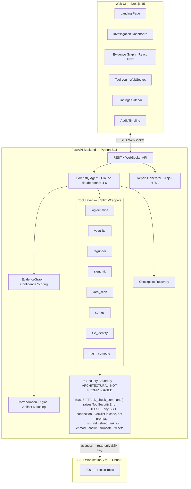
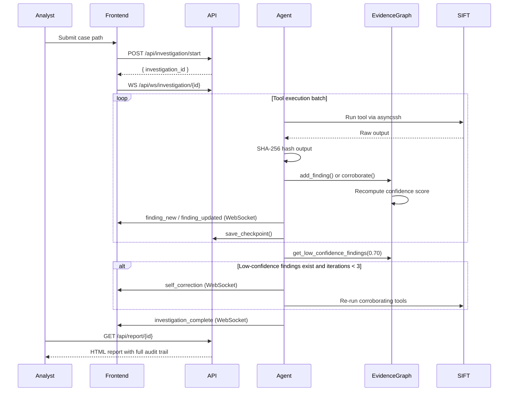

# ForensIQ — Architecture

## System Overview

ForensIQ is a three-tier system: a Next.js frontend, a Python FastAPI backend containing the Claude agent and evidence engine, and a SIFT Workstation VM where forensic tools execute.

The core design principle: **confidence is computed by the EvidenceGraph, never by the LLM**. The agent selects and runs tools. The engine scores the evidence deterministically. The label on every finding reflects what the data says, not what the model guesses.

## System Architecture



## Investigation Sequence



## Confidence Scoring (ADR-001)

**Decision:** Confidence is computed by the EvidenceGraph, never by the Claude agent.

**Formula:**

| Event | Delta |
|---|---|
| First tool reports finding | Base: `0.50` |
| Additional tool corroborates | `+0.20` per tool, cap `0.95` |
| Tool contradicts | `-0.25` per tool, floor `0.10` |

**Thresholds:**

| Label | Condition |
|---|---|
| FACT | confidence >= 0.85 AND sources >= 3 |
| INFERENCE | confidence >= 0.50 |
| HYPOTHESIS | confidence < 0.50 |

**Rationale:** Separating confidence calculation from the LLM prevents hallucinated confidence scores. The formula is deterministic, auditable, and reproducible. A reviewer can recompute any score from the tool outputs alone.

## Corroboration Engine (ADR-002)

**Decision:** Corroboration is triggered by shared concrete artifacts across tool outputs, not by LLM judgment.

**Artifact types extracted:** IPv4 addresses, PIDs, SHA-256/MD5/SHA-1 hashes, file paths, Windows registry keys, domain names, executable filenames.

**Mechanism:** `artifacts.py` extracts artifact sets from raw tool output using regex patterns. `EvidenceGraph.find_matching_finding()` checks whether any incoming artifact set overlaps with an existing finding's artifact set. If so, `corroborate()` is called automatically before any LLM involvement.

**Rationale:** Eliminates duplicate findings and ensures confidence rises only when independent tools confirm the same concrete indicator, not when the LLM decides two outputs are similar.

## Self-Correction Loop (ADR-003)

**Decision:** After each tool execution batch, review all findings below confidence 0.70 and request additional corroborating tool runs.

**Max iterations:** 3 (configurable via `MAX_CORRECTION_ITERATIONS`)

**Rationale:** Unlimited correction creates infinite loops. Three iterations is sufficient for realistic incident cases and keeps investigation time bounded. Self-correction fires on low confidence, not on tool failures. Tool failures are handled separately by returning an error string and logging the event.

## Security Architecture (ADR-004)

**Decision:** Destructive command blocking is implemented at the tool layer in code, not in the agent system prompt.

**Blocked command prefixes:**
```
rm  dd  shred  mkfs  fdisk  chmod  chown  truncate  > /  sudo rm  sudo dd  wipefs  mv  cp  ln
```

**Mechanism:** `BaseSIFTTool._check_command()` in `tools/base.py` raises `ToolSecurityError` before any SSH connection is made if the command matches the blocklist. The agent cannot bypass this by rephrasing the prompt, using a different tool, or injecting content through case data.

**Rationale:** Prompt-based safety can be overridden by adversarial case data or model behavior. Architectural enforcement cannot. The blocklist lives in code, ships with the application, and is testable.

**Additional controls:**
- SSH key should be scoped to read access only on the SIFT VM
- Every tool output is SHA-256 hashed before the LLM sees it, preventing log-injection attacks from overwriting the audit record
- `ToolSecurityError` is broadcast to the frontend as a `tool_error` event, so blocked attempts are visible to the analyst

## Checkpoint Recovery (ADR-005)

**Decision:** Persist investigation state to disk after every `finding_new` and `finding_updated` event.

**Mechanism:** `checkpoint.py` writes `<investigation_id>.json` to the `checkpoints/` directory using an atomic write pattern (`*.json.tmp` → `*.json`). `EvidenceGraph.from_dict()` restores the full graph on resume. Checkpoint is deleted on clean completion.

**Rationale:** The EvidenceGraph lives in memory. A backend restart mid-investigation would lose all findings without this. The atomic write ensures a crash during the write itself does not corrupt the saved state.

## Data Flow

```
1. POST /api/investigation/start
   → Creates in-memory investigation record
   → Spawns background task: ForensIQAgent.investigate(case_path)

2. ForensIQAgent.investigate()
   → Sends messages to Claude API with tool definitions
   → Claude responds with tool_use blocks
   → Agent executes each tool via SSH to SIFT VM
   → Returns tool_result to Claude

3. Each tool execution:
   → Broadcasts tool_start to WebSocket clients
   → Runs command on SIFT VM via asyncssh
   → SHA-256 hashes the raw output
   → Calls EvidenceGraph.find_matching_finding() for corroboration check
   → Calls add_finding() or corroborate() on the graph
   → Broadcasts finding_new or finding_updated
   → Saves checkpoint to disk

4. After each Claude response batch:
   → Calls EvidenceGraph.get_low_confidence_findings(0.70)
   → If any exist and iterations < 3: appends correction instruction
   → Broadcasts self_correction events to frontend

5. When Claude calls finish_investigation:
   → Broadcasts investigation_complete with summary counts
   → Report available at GET /api/report/{id}
   → Checkpoint deleted
```

## API Reference

| Method | Path | Purpose |
|---|---|---|
| `GET` | `/api/health` | Health check |
| `POST` | `/api/investigation/start` | Start a new investigation |
| `GET` | `/api/investigation/{id}` | Fetch state and findings |
| `POST` | `/api/investigation/resume/{id}` | Resume from checkpoint |
| `GET` | `/api/checkpoints` | List resumable investigations |
| `DELETE` | `/api/checkpoint/{id}` | Delete checkpoint |
| `GET` | `/api/report/{id}` | Export HTML report |
| `WS` | `/api/ws/investigation/{id}` | Stream live events |

## Environment Variables

| Variable | Required | Default | Description |
|---|---|---|---|
| `ANTHROPIC_API_KEY` | Yes | - | Anthropic API key |
| `SIFT_HOST` | Yes | `192.168.56.101` | SIFT VM IP |
| `SIFT_PORT` | No | `22` | SSH port |
| `SIFT_USER` | No | `sansforensics` | SSH username |
| `SIFT_SSH_KEY_PATH` | Yes | - | Path to SSH private key |
| `CLAUDE_MODEL` | No | `claude-sonnet-4-6` | Claude model ID |
| `MAX_CORRECTION_ITERATIONS` | No | `3` | Self-correction cap |
| `CONFIDENCE_CORRECTION_THRESHOLD` | No | `0.70` | Trigger threshold |
| `CHECKPOINT_DIR` | No | `./checkpoints` | Checkpoint storage path |
